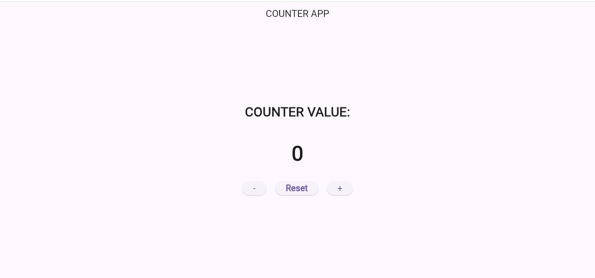
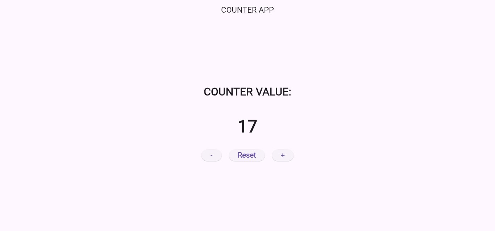
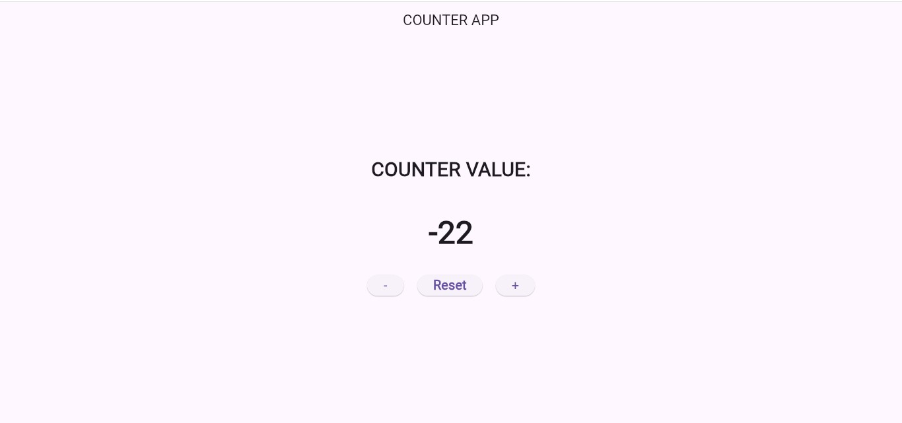

# Counter App

A simple and intuitive Counter application built with Flutter that demonstrates state management and local data persistence.

## Features

- **Increment**: Increase the counter value by 1.
- **Decrement**: Decrease the counter value by 1.
- **Reset**: Reset the counter value back to 0.
- **Persistence**: Uses `shared_preferences` to save the counter value locally, so your progress is saved even after closing the app.

## Project Structure

- `lib/main.dart`: Contains the entire application logic and UI.
- `pubspec.yaml`: Manages project dependencies and assets.

## Dependencies

- `shared_preferences`: For local data storage.
- `cupertino_icons`: For iOS-style icons.

## Getting Started

### Prerequisites

- [Flutter SDK](https://docs.flutter.dev/get-started/install) installed.
- An editor like Android Studio, VS Code, or IntelliJ.
- An Android/iOS emulator or a physical device.

### Installation

1.  **Clone the repository**:
    git clone https://github.com/fffshafi902-droid/counterapp_project.git

## Screenshots

